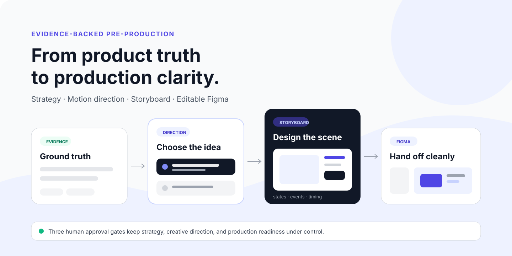
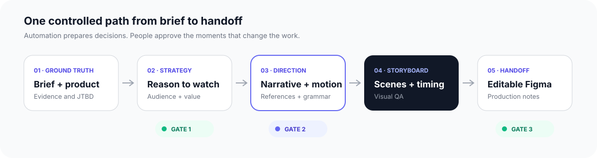

<p align="center">
  <a href="docs/ru/README.md">Русский</a> ·
  <a href="START_HERE.md">Start without a terminal</a> ·
  <a href="examples/ledgerly/README.md">Example project</a> ·
  <a href="docs/ARCHITECTURE.md">Architecture</a>
</p>

<picture>
  <source media="(prefers-color-scheme: dark)" srcset="docs/assets/readme/hero-dark.svg">
  <source media="(prefers-color-scheme: light)" srcset="docs/assets/readme/hero-light.svg">
  
</picture>

# SaaS Creative Director

**From product evidence to a production-ready SaaS video storyboard.**

A Claude-powered pre-production system that turns briefs, product materials, research, and visual references into an approved creative direction, timed storyboard, editable Figma wireframes, and a clear production handoff.

It plans the work. Your team owns the taste, craft, and final film.

[](CHANGELOG.md)
[](https://github.com/denius89/saas-creative-director/actions/workflows/ci.yml)
[](LICENSE)

> **Preview status:** the contracts, validation, safe update path, example project, and deterministic Figma importer are automated and tested. Live Figma canvas verification and the first blind visual-modernity pilot remain release acceptance steps.

## What you get

| | Outcome |
|---|---|
| **Evidence-backed strategy** | Product claims, supported interpretations, and hypotheses stay separate before they reach the script. |
| **Current motion direction** | Date-stamped visual knowledge, reusable patterns, and conditional anti-pattern checks guide contemporary choices. |
| **Scene-level references** | References are retrieved for the communication job of each scene without copying a studio's style. |
| **Timed storyboard** | Every scene carries purpose, message, states, events, transitions, evidence, and production semantics. |
| **Editable Figma wireframes** | A deterministic local importer creates native nodes with stable IDs, visible notes, and safe re-import behavior. |
| **Production handoff** | Visual QA, missing assets, locked decisions, creative freedom, and open blockers remain explicit. |

## How it works

<picture>
  <source media="(prefers-color-scheme: dark)" srcset="docs/assets/readme/pipeline-dark.svg">
  <source media="(prefers-color-scheme: light)" srcset="docs/assets/readme/pipeline-light.svg">
  
</picture>

The system uses one orchestrator with composable skills. Humans approve strategy, creative direction, and production readiness; the workflow resumes from revision-bound checkpoints instead of repeating the whole project.

## See a complete example

**Ledgerly** is a fictional SaaS project that demonstrates the full handoff without client data. These are real versioned repository artifacts:

| Decision layer | Ledgerly artifact |
|---|---|
| Why the video should exist | [Video strategy](examples/ledgerly/artifacts/video-strategy.json) |
| How the story should move | [Narrative](examples/ledgerly/artifacts/narrative.json) |
| How the visual system should behave | [Motion direction](examples/ledgerly/artifacts/motion-direction.json) · [Visual direction](examples/ledgerly/artifacts/visual-direction.json) |
| What appears scene by scene | [Storyboard](examples/ledgerly/artifacts/storyboard.json) |
| What the local importer receives | [Figma manifest](examples/ledgerly/artifacts/figma-manifest.json) |
| Whether it is ready to hand off | [Visual QA](examples/ledgerly/reviews/visual-qa.json) · [Production review](examples/ledgerly/reviews/production-review.md) |

The illustrations describe the verified workflow. They are not presented as live Figma screenshots; real canvas exports will be added after the documented [live verification checklist](docs/FIGMA_LIVE_VERIFICATION.md) is complete.

## Start in five minutes

No Python, terminal, npm, or manual JSON editing is required for the normal creative workflow.

1. Download this repository as a ZIP and unpack it.
2. Open the folder in Claude Code.
3. Put the brief, product screenshots, PDFs, and notes in `INBOX/`.
4. Ask Claude:

   > Start a new project. The client materials are in INBOX. Guide me one decision at a time.

For the Russian no-code flow, use [START_HERE.md](START_HERE.md). To evaluate the system without client material, open the [Ledgerly example](examples/ledgerly/README.md).

<details>
<summary><strong>Developer and maintainer commands</strong></summary>

```bash
./scd validate examples/ledgerly
./scd status examples/ledgerly
./scd figma-manifest examples/ledgerly --output /tmp/ledgerly-figma.json
./scripts/test.sh
```

Installation, release packaging, updates, migrations, and rollback are documented in [Installation](docs/INSTALLATION.md), [Releasing](docs/RELEASING.md), and [Upgrading](docs/UPGRADING.md).

</details>

## Built for controlled AI work

- **Evidence before claims.** Every externally meaningful claim points to evidence, and `HYPOTHESIS` is never silently promoted to fact.
- **Humans at creative decisions.** Three revision-bound gates prevent later automation from overwriting an approved decision unnoticed.
- **Current without style copying.** The reference layer records provenance and abstracts reusable visual grammar instead of reproducing a studio's look.
- **Bounded Claude usage.** Compact context packets, caching, scene-level retrieval, targeted repairs, and checkpoints reduce repeated work. Paid Usage credits or API billing are never enabled automatically.
- **Protected client work.** `INBOX/`, projects, local configuration, overrides, and custom knowledge stay outside product updates and release archives.

Read [Motion Intelligence](docs/MOTION_INTELLIGENCE.md), [Data handling](docs/DATA_HANDLING.md), [Security](docs/SECURITY.md), and [Claude usage and billing](docs/USAGE_AND_BILLING.md) for the exact boundaries.

## Figma handoff

The bundled local importer compiles approved scene data into native frames, text, UI cards, rows, connectors, and visible handoff annotations. It validates bounded typed input before writing, records operation receipts, detects manual visual edits, and creates a new revision instead of merging over changed boards.

Figma output is an editable production wireframe, not final illustration or animation. See the [Figma workflow](docs/FIGMA_WORKFLOW.md) and [Russian plugin guide](figma-plugin/README_RU.md).

## Documentation

| For creative teams | For technical review | For maintenance |
|---|---|---|
| [Start here](START_HERE.md) | [Architecture](docs/ARCHITECTURE.md) | [Installation](docs/INSTALLATION.md) |
| [Russian documentation](docs/ru/README.md) | [Motion Intelligence](docs/MOTION_INTELLIGENCE.md) | [Updating](docs/ru/UPDATING.md) |
| [Example project](examples/ledgerly/README.md) | [Reference research policy](docs/REFERENCE_RESEARCH_POLICY.md) | [Releasing](docs/RELEASING.md) |
| [Figma workflow](docs/FIGMA_WORKFLOW.md) | [Security model](docs/SECURITY.md) | [Changelog](CHANGELOG.md) |

<details>
<summary><strong>Repository map</strong></summary>

```text
core/skills/                 versioned Claude Skills
.claude/skills/              discovery adapters
core/src/                    orchestration, validation, context, usage, Figma compiler
core/schemas/                contracts between stages
figma-plugin/                bundled local importer
knowledge/references/        curated reference records
knowledge/patterns/          abstract visual grammar
knowledge/current-motion/    date-stamped motion synthesis
knowledge/anti-patterns/     conditional failure detectors
evals/                       quality and blind A/B protocols
examples/ledgerly/           complete fictional project
docs/                        user, architecture, safety, and lifecycle documentation
```

</details>

## Scope

SaaS Creative Director ends at approved creative direction, storyboard, editable Figma wireframes, visual QA, and production handoff. It deliberately does not generate the final video. Final illustration, animation, sound, compositing, and taste remain production work.

## License

[MIT](LICENSE)
